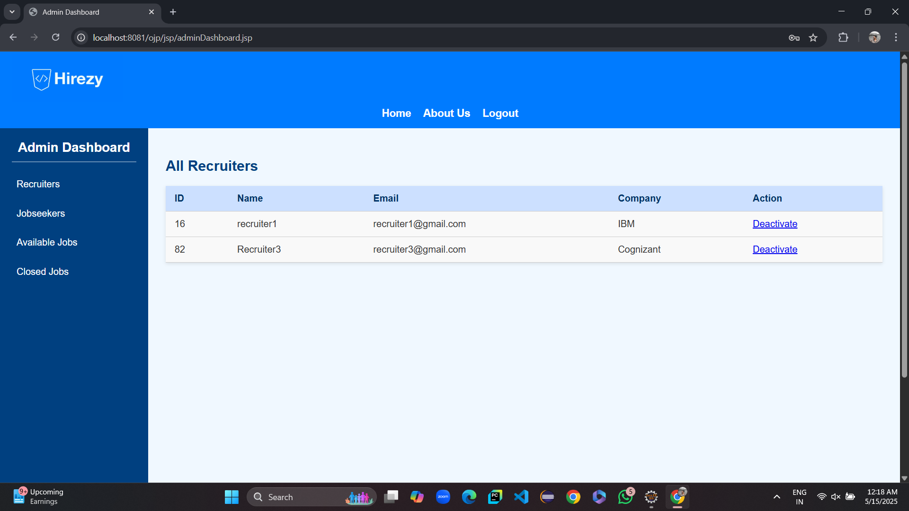
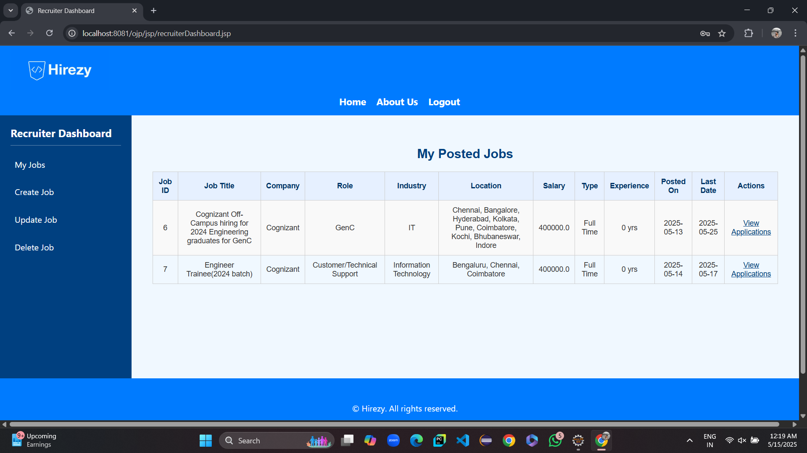
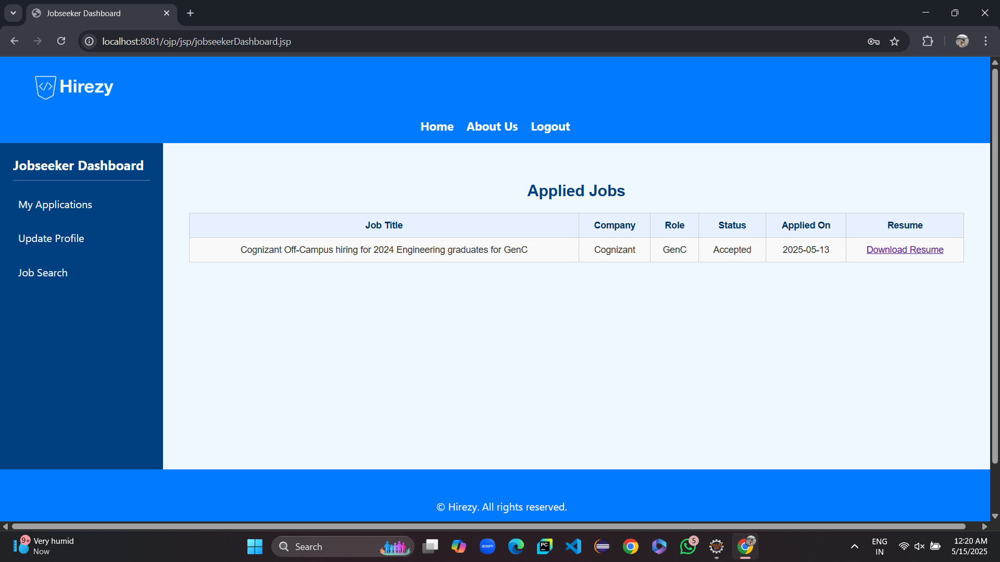

# Online Job Portal System


## Overview

The **Online Job Portal System** is a comprehensive web application designed to connect job seekers with recruiters and administrators efficiently. The system supports role-based access with separate dashboards for Admin, Recruiter, and Jobseeker. Users can register, post jobs, search for jobs, and apply, while recruiters can manage job postings and applications.

This project is implemented using Java Servlets, JSP, Oracle Database, and follows MVC architecture principles.

---

## 🛠️ Technology Stack

- Java Servlets & JSP
- Oracle Database 10g
- JDBC for database connectivity
- HTML, CSS, JavaScript
- Apache Tomcat Server
- Eclipse IDE
---

## ✨ Features

- User registration/login for Admin, Recruiter, Jobseeker
- Role-based dashboards with separate functionality
- Job posting and management by Recruiters
- Job search and application by Jobseekers
- Admin control over users and system
- Application status tracking and interview scheduling
- Contact Us form to collect messages
- Resume upload with unique Google Drive links


## 👤 User Roles and Their Features

The Online Job Portal System supports three primary user roles: **Admin**, **Recruiter**, and **Jobseeker**. Each role has specific functionalities designed to streamline the job posting and application process.

### 1. Admin
- Manages the overall system.
- Has access to view and manage all users (recruiters and jobseekers).
- Can oversee posted jobs and applications.
- Maintains system integrity by activating or deactivating user accounts.
- Handles administrative tasks and ensures smooth operation of the platform.

### 2. Recruiter
- Registers and logs in to post job vacancies.
- Creates, updates, and manages job listings.
- Views applications submitted by jobseekers for their posted jobs.
- Schedules interviews and updates application statuses.
- Manages company profile details like company name, contact person, and website.

### 3. Jobseeker
- Registers and logs in to browse available jobs.
- Searches and applies for jobs matching their skills and preferences.
- Uploads and maintains their resume (with unique resume path links).
- Tracks the status of their job applications.
- Receives interview schedules and status updates from recruiters.

Each role is designed to facilitate a smooth and efficient recruitment workflow, providing tailored features based on the user’s needs.

---

## 📸 Screenshots

### Admin Dashboard  


### Recruiter Dashboard  


### Jobseeker Dashboard  


---

## 🧪 How to Run
1. **Clone the repo**:
   ```bash
   git clone https://github.com/yourusername/job-portal-system.git

2. **Set up Oracle DB**:
   - Create tables from create_tables.sql
   - Insert sample data from insert_sample_data.sql

3. **Import project in Eclipse**:
   - Use Dynamic Web Project
   - Add Oracle JDBC driver
   - Configure web.xml and DB connection

4. **Deploy to Apache Tomcat**

5. **Visit**: http://localhost:8080/JobPortal/

---

## 🎥 Video Demo

👉 [Click here to watch the demo video on LinkedIn](https://www.linkedin.com/posts/yourname_job-portal-demo-activity-123456789)

> ⏱️ Duration: 3 minutes  

---

## 👨‍💻 Contact
Siddartha Kumbajadala
📧 Email: siddarthakumbajadala@gmail.com

